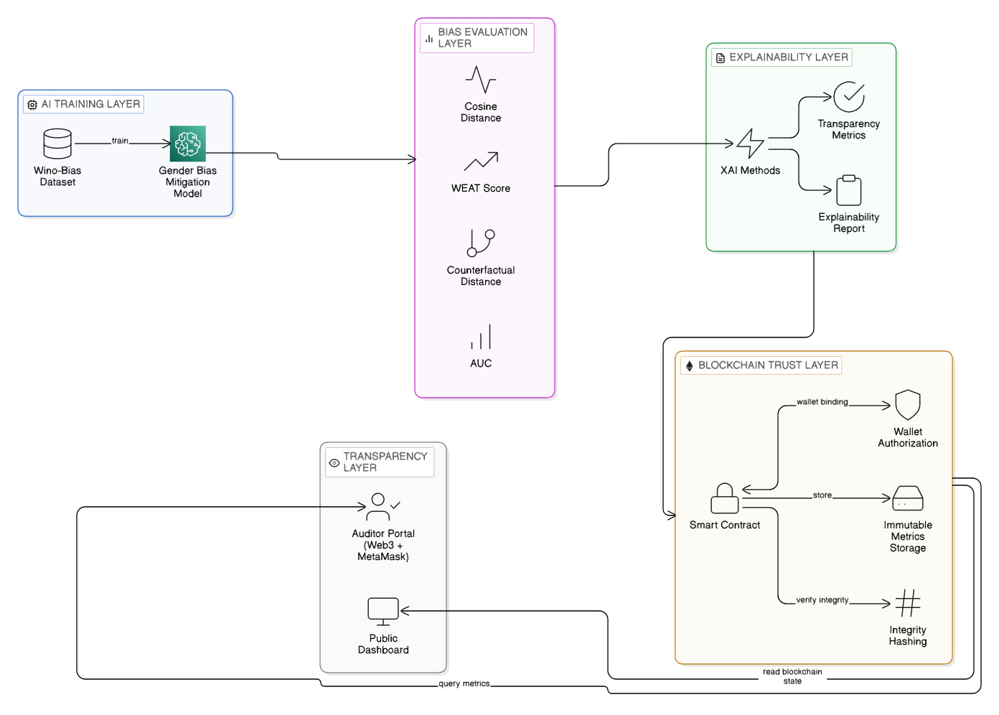

# Decentralized Fairness Validation in Language Models

[](https://opensource.org/licenses/MIT)
[](https://sepolia.etherscan.io/)
[](https://www.python.org/downloads/release/python-3120/)
[](https://streamlit.io/)

A unified framework for bias mitigation, topological explainability, and cryptographic verification across LLM architectures.

## ✨ Abstract
Transformer-based language models propagate structural biases, limiting their trustworthy deployment in high-stakes domains. This work presents a unified framework for bias mitigation, explainability, and cryptographic verification across diverse architectures, including bidirectional encoders (BERT) and generative decoders (Phi-3, Qwen). We advance bias evaluation from superficial probability metrics to intrinsic geometric analysis (Cosine Distance, WEAT) and utilize the Logit Lens for layer-wise bias analysis, tracking exactly where stereotypes form computationally. 

To resolve cross-architecture explainability challenges, we introduce tokenizer-agnostic “Linguistic Mega-Tokens” and Target-Self-Attention Masking, enabling mathematically consistent “Bias Gaze Snapshots” using SHAP, LIME, and LIG. Finally, we secure auditability using a Zero-Trust Decoupled Blockchain Architecture. By enforcing Cryptographic Role-Based Access Control (RBAC) via MetaMask-signed Solidity smart contracts, the system guarantees immutable, decentralized verification of fairness metrics. Ultimately, this establishes a robust, end-to-end pipeline for auditing and enforcing fairness in Large Language Models.

---

## 🏛️ Ecosystem Architecture



## 📁 Repository Structure

The project is decoupled into micro-repositories, maintaining clear boundaries between the deep-learning backend and the Web3 infrastructure.

| Directory | Purpose |
| --- | --- |
| `Agentic_BERT_Dashboard/` | Contains the core PyTorch/HuggingFace backend and the Streamlit dashboard for generating SHAP, LIME, and LRP fairness explanations. |
| `blockchain_ui_trial/` | Web3 frontend portal acting as the Auditor's bridge to securely map agent outputs to Ethereum using `ethers.js`. |
| `contracts/` | Solidity Smart Contracts enabling Role-Based Access Control (RBAC) and immutable storage for XAI audits. |
| `scripts/` | Hardhat deployment scripts for testing smart contracts on the Sepolia Testnet. |

---

## 🚀 Getting Started

To spin up the ecosystem, you need to run the Agentic Explainability framework and the Blockchain Auditor UI concurrently.

### 1. Launching the Agentic Dashboard
This module serves the AI inference models and generates the explainability reports.
```bash
# Navigate to the dashboard directory
cd Agentic_BERT_Dashboard/explainability

# Install the Python dependencies
pip install -r requirements.txt

# Run the Streamlit Dashboard
streamlit run dashboard.py
```
*(See `Agentic_BERT_Dashboard/README.md` for extended Python/GPU setup notes).*

### 2. Launching the Web3 Auditor Portal
This module hosts the static React/HTML portal which bridges the AI Agent's decisions to the Sepolia Blockchain using MetaMask.
```bash
# Navigate to the web frontend directory
cd blockchain_ui_trial

# Launch a lightweight web server
python -m http.server 8000
```
*(See `blockchain_ui_trial/README.md` for MetaMask connection instructions).*

### 3. Deploying Smart Contracts (Optional)
If you wish to deploy a fresh instance of the Auditor smart contract:
```bash
# Install Hardhat and dependencies at the root
npm i

# Run Hardhat compilation and deploy scripts
npx hardhat compile
npx hardhat run scripts/deploy.ts --network sepolia
```

## 🔐 Security & Non-Repudiation Model
Our zero-trust architecture utilizes **Cryptographic Hash-and-Link**. At no point are actual Resumes (PII) recorded to an open blockchain. Instead, the Streamlit backend natively hashes the Markdown XAI explanations, preventing manipulation. The Auditor formally commits this payload to the Smart Contract, generating a permanent `tx` receipt connecting the specific model version, decision, and time explicitly together.
